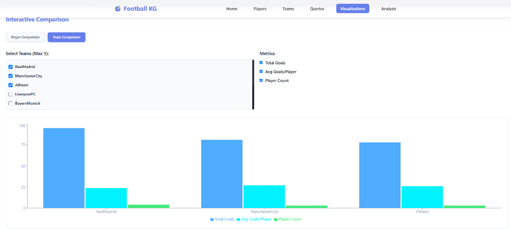
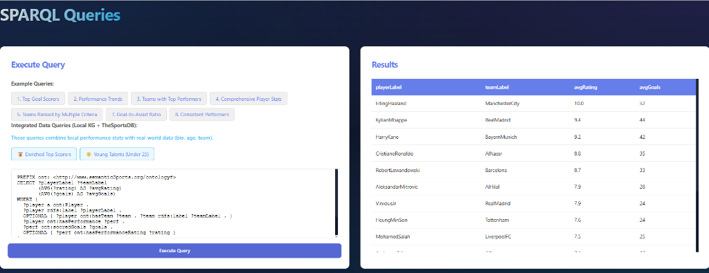
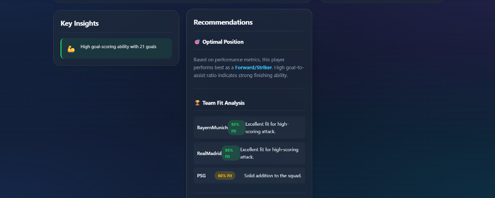
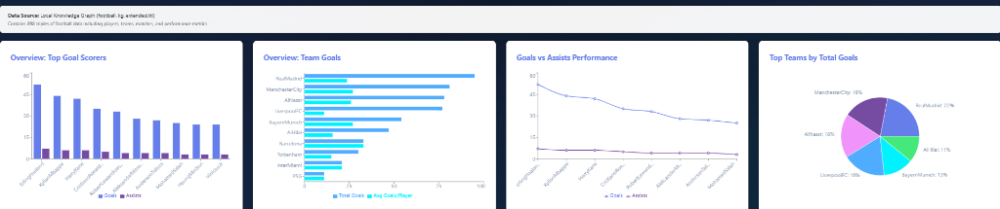
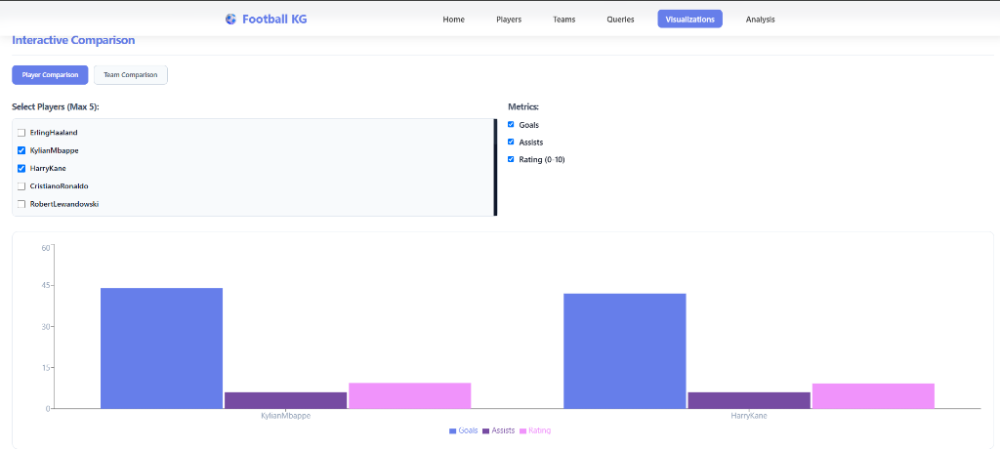

# Football Knowledge Graph Project

This project is a Knowledge Graph (KG) application focused on football data. It uses semantic web technologies like RDF, SPARQL, and OWL to build a graph-based database of football players, teams, and their performances.

## Project Structure

```text
football-kg/
├── api.py               # Main Flask API server
├── football_kg_extended.ttl # Knowledge Graph data
├── kg_pipeline.py       # Data enrichment scripts
├── kg_queries.py        # SPARQL query examples
├── requirements.txt     # Python dependencies
└── webapp/              # React Frontend (Vite)
    ├── src/             # Application source code
    └── vite.config.js   # Frontend configuration
```

## Getting Started

### 1. Backend Setup (Flask API)

1. **Prerequisites**: Python 3.8+
2. **Setup**:
   ```bash
   pip install -r requirements.txt
   ```
3. **Run**:
   ```bash
   python api.py
   ```
   The API will be available at `http://localhost:5000`.

### 2. Frontend Setup (React App)

1. **Prerequisites**: Node.js 16+
2. **Setup**:
   ```bash
   cd webapp
   npm install
   ```
3. **Run**:
   ```bash
   npm run dev
   ```
   The web app will be available at `http://localhost:3000`.

## Troubleshooting

### Common Issues
- **Port 5000/3000 in use**: Ensure no other instances are running.
- **CORS Errors**: Handled automatically in `api.py`, but check if your browser blocks local requests.
- **KG Not Loading**: Ensure `football_kg_extended.ttl` is in the root directory.

## Features
- **Knowledge Search**: Explore players and teams.
- **SPARQL Interface**: Run custom queries against local and external sources.
- **Insights**: Performance analysis and team fit recommendations.

## Web Application Preview

Here are some previews of the web application and its features:

### 1. Dashboard & Visualizations Overview


### 2. Interactive Player Comparison


### 3. Interactive Team Comparison


### 4. SPARQL Queries & Results


### 5. Insights & Team Fit Recommendations


